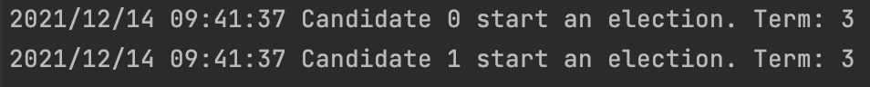

# NJU-DisSys-2017
This is the resource repository for the course Distributed System, Fall 2017, CS@NJU.

In Assignment 2 and Assignment 3, you should primarily focus on /src/raft/...

# IDE 使用
- Shift + Command + F: Find in files
# 环境配置
- 设置 Project GOPATH 为当前项目的根目录
# Assignment 1
## 先梳理一下包括选举阶段整体的流程
- GoRoutine: 所有的节点都是 follower, 不断的接受 leader 发来的 heartbeat
  - heartbeat 的回复
    - false if term < currentTerm
- heartbeat 超时的话
  - follower 节点变成 candidate, 参加选举
    - currentTerm += 1
    - 给自己投票， votedFor = me, voteCount += 1
    - reset election timer
    - 发送 RequestVote RPC
  - 需要有一个数据结构 role: "leader" | "candidate" | "follower"
  - follower: 
    - false if term < currentTerm
    - true if votedFor null (当前 term 还没有投过票)
  - candidate:
    - 如果收到的 response 中 term > currentTerm
      - currentTerm = term; votedFor = null; 变回 follower --> role = "follower", 不管选举的结果了
    - 收到了多数票: 成为 Leader
    - election timeouts: 再次 election
    - 收到 Leader 的 appendEntries: 成为 follower
- Leader:
  - heartbeat timeout: 每次到时间就发送空的 AppnedEntries (暂时先不考虑日志), 这个 timeout 应该小于 election timeout
  - 无论什么 RPC, 如果收到的 term > currentTerm， 就变成 follower

## RPC
- RequestVoteArgs and RequestVoteReply structs: 参考 Figure 2
- RequestVote RPC handler: RequestVote()
    - 向所有的 peers sendRequestVote (需要排除自己 me)
    - if ok, 那么读取 reply 里头的 Term 和 VoteGranted
    - 如果超过半数同意，则需要修改这个节点的 状态（Persister?) 和 currentTerm
## heartbeat 机制的相关实现
- 首先在 Raft 的结构体里头，应该有计时器
  - time.Ticker?
  - candidate 的计时器，时间范围是 150-300 (取一个这个范围内的随机数？而且是每次要取不同的). 超出这个时间范围，没收到 heartbeat, 就变成 candidate
  - leader 的计时器，时间范围应该少于 150？(统一 100ms 干脆)， 这样 follower 能够及时收到 heartbeat
- https://zhuanlan.zhihu.com/p/128622498: 这篇文章推荐通过 Time.sleep() 完成 timeout
- 在 Raft struct 里头维护上一次收到 heartbeat 的时间/上一次发送 heartbeat 的时间
- 利用 Time.sleep() 周期性的去检查是否超时
- background goroutine?
## 一些编程方面的注意点
- 所有状态的检查: GetState(); 需要加锁
- 读取 RPC 的返回值: 这显然是一个异步操作，不能够直接读取结果
  - 读取 RequestVote 的结果
  - 读取 AppendEntries 的结果 (包括 heartbeat)
- 把 Log 全部加上！
## 面向测试编程
- 目前的问题出现在节点死亡的时候
  - 这个 RPC 会阻塞，导致是否收到多数票的判断也失败；那么就无法决出 Leader
  - "读取 RPC 的返回值: 这显然是一个异步操作，不能够直接读取结果"， 大抵确实是这个问题罢
  - go 提供了 channel 机制，实现类似异步回调的机制
- 两个候选者同时发起选举，无人胜出
  - 
  - 我认为是选举超时机制没有生效
    - 弄了一个选举专用的 timer (Time.After) 就 OK 了
## Timer 的使用
- Timer.Stop()
- Timer.Reset()
- case <-rf.electionTimer.C:
## 如何执行一个异步任务，并统计任务的执行结果
- 先定义 replyCh, 异步任务可以通过这个 Channel 返回执行结果
- 异步任务作为 background goroutine: go func()
- 读取 channel 返回的内容: case reply := <-replyCh
## 角色转换的时候直接修改 role, 是否会有 bug?
- 例如 candidate -> follower, 但是没有停止 Campaign, 随后又变成 leader?
- 变成 follower: 统一成一个函数
- 进一步执行的时候（例如 Campaign 时统计票的时候), 需要再次校验角色

# Assignment2
## 梳理 Log Replication 阶段的整体流程
- 领导者处理客户请求，添加日志条目
- 领导者通过 AppendEntries 向其他节点复制这个条目
- 如果该条目复制到超过半数节点上（又是一个计票），领导者执行这个条目，并通知其他节点

### 领导者通过 AppendEntries 向其他节点复制这个条目
- 在下一次 heartbeat 的时候带上条目信息

### 领导者执行条目
- 同时把所有 index 更小的，还没执行的都执行掉 
### 通知其他节点执行条目
- AppendEntries 里带上 index 和 term
### 日志条目不一致咋办
- AppendEntries 里头带上 nextIndex, 跟随者如果发现不匹配，则拒绝
- nextIndex 递减，直到匹配
- 覆写往后的日志

## 编程想法
- 先完成简单的 Log replication, 不管 log 不一致等异常情况
### Start()
### AppendEntries RPC struct
### AppendEntries RPC handler
### 日志的 index 从 1 开始
- 所以初值设为 0
- Term 的初值也应设为 0
### 发送 Log 的时机是什么？
- len(rf.log) - 1 > rf.commitIndex
- 可能有多个 log, 全部发送

## TODO
- **最后记得把代码全部放到 raft.go 里面！**
- 是否对每个 follower 应该维护一个 leaderID, follower 只接受这个 leader 发来的日志
- 减小 nextIndex 这一步操作还没完成
- HeartBeat 里头没更新参数，就接着发 HeartBeat
  - 把 HeartBeat 和 真正的 AppendEntries 分开呢
- 在 Leader 收到了多数票之后，需要真正 apply 这个 log (rf.applyCh)
  - 同时，follower 也要去 apply 这个 log (leader 应该接着发一个带上 index 和 term 的 HeartBeat?)
- 现在的 apply 都是硬编码
  - 对于 leader, apply 所有发送给 follower, 且收到多数票的 entries
  - 对于 follower，需要比较leader 的 commitIndex 和 term，来确定 apply 哪些

- *如何判断哪些 log 需要发送？
  - *len(rf.log) - 1 > rf.commitIndex?
  - *rf.log 下标从1处开始
  - *可能会发送多个 log

- *Reply false if log doesn't contain an entry at prevLogIndex 
  - whose term matches prevLogTerm

- *RequestVote: 当 candidate log up-to-date 时，才 grant vote
  - up-to-date: 5.4.1, 比较 last log entry
    - term 不同，term 更大的，更 up-to-date
    - same term: log 更长，更加 up-to-date

- *看看 AppendEntries, leader 应该怎么处理
  - Safely Replicated(超过半数的回复)， apply state machine +  respond to client

- log 的重发：只对发送失败的？
  - 不止，对于 reply 为 false的，还有 nextIndex 等需要更新
- RealAppendEntries: 是否需要改成每次只发一个 entry? 是的

- nextIndex 和 matchIndex
  - *nextIndex 初值为 leader last log index + 1 (每次有新的 leader 产生时更新)
  - *matchIndex 初值为 0
  - *发送 AppendEntries 时，如果 leader.lastLogIndex > nextIndex[i], 则发送 nextIndex[i] 位置上的日志
  - *AppendEntries 成功: 更新 nextIndex 和 matchIndex
  - *AppendEntries 失败：递减 nextIndex, 重发消息
  - *args 要搞一个副本，不要互相弄混了

- 有一个比较麻烦的：需要区分follower 是针对哪个 log 进行回复的
  - 由于会比较 nextIndex 然后才发送日志，所以给每个节点发送的日志可能不是同一个
  - 最好的做法是：每个日志有一个投票的处理机制，怎么实现呢？
  - 定义一个 replicatedVote, 记录每个日志收到的投票数；如果超过半数，就可以 commit 了

## Debug
- Leader 2 apply log entry 5, 大家都没有 apply
  - 为什么只有最后一个 apply 不了？
  - 之前的 log entry, 每次client 有新的 log entry 来时，follower 会顺便 commit 之前没 commit 的
  - 简而言之，就是 HeartBeat 里头也要带上 prevLog, commitIndex 这些信息
  - Follower 收到 HeartBeat 的时候，也要去更新 commitIndex, 执行状态机等等
  - 解决了，就是这个问题！